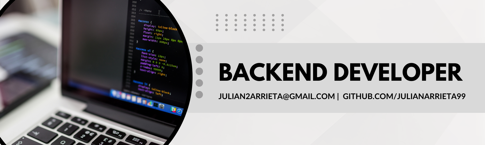

👋🏻 Hello! I'm Julian Arrieta 

🚀 I entered the field of web development at the beginning of 2023. Since then I have been immersed in a variety of projects that have allowed me to constantly refine my technical skills. I focus on bringing significant value to each project in which I participate, aiming at improving the user experience and satisfying customer requirements.

💡 In my experience I have also had the opportunity to strengthen my soft skills by participating in multidisciplinary teams, maintaining effective communication and working with agility. My goal is to optimize functionalities and generate effective communication with my team, thus contributing to the collective success.

🌱 For my future I hope to explore new challenges, and continue contributing to the success of web projects as I grow in the field of web development and discover new technologies.

💼 If you are interested in my profile feel free to contact me and we will arrange an interview!

[Linkedin](https://www.linkedin.com/in/julian-arrieta-dev/) | 
[Email me!](mailto:julian2arrieta@gmail.com)
